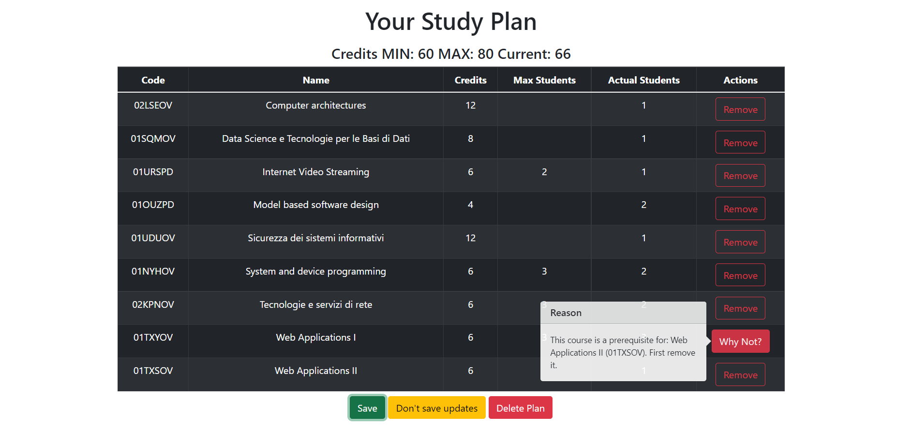

# Exam #1: "StudyPlan"
## Student: s297925 BATTIPAGLIA ANTONIO 

## React Client Application Routes

- Route `/`: This route is the homepage of the website, since the homepage is different for users which are logged or not, depending on this will be rendered two different components `CoursesRoute` (for not loggedIn users) and `StudyPlanRoute` (for those who are loggedIn)
- Route `/login`: The role of this route is to render the `LoginRoute` component if the user is not loggedIn and avoid any attempt to login again from those users which are already loggedIn (by using `Navigate`)
- Route `*`: If any other path is selected, this route will render a `DefaultRoute` component.

## API Server

- POST `/api/sessions`
  - Allows the user to authenticate himself. If the credentials are valid
    it returns his non-sensitive information.
  - Body content is a JSON object which has username (the email inserted) and password.
  - Responses can be different:
    - 201 Created (success), indicates that the request has succeeded and has led to the creation of the cookie and the session. Here is the object:
    ```
    {
      name: 'Obtained Name',
      full: 'Full-time StudyPlan'
    }
    ```
    - 400 Bad Request, it occurs when there is an error in terms of validation 
    - 401 Unauthorized, this happens when username or password are wrong.
    - 500 Internal Server Error. If something went wrong body contains the error occurred.
- GET `/api/sessions/current`
  - It checks if the user has a valid session to perform any action, in case of a valid one it returns his non-sensitive information.
  - Body content is empty since it is a GET method. In the header there will be the cookie received by the server in phase of authentication.
  - Responses can be different:
    - 200 OK (success), indicates that the request has succeeded. Body contains the same object of the previous API (**POST `/api/sessions`**).
    - 401 Unauthorized, this happens when the user is not authenticated.
- DELETE `/api/session/current`
  - Used to destroy the session of an authenticated user.
  - Body content is empty. As seen previously, in the header must be present the cookie assigned by the server at login time to identify the session to destroy.
  - Responses:
    - 200 OK (success). Body is empty.
    - 401 Unauthorized, this happens if the cookie of the session is not valid or if the session does not exist.
- GET `/api/courses`
  - Allows to retrieve all courses available from the database.
  - Body content is empty.
  - Responses:
    - 200 OK (success). Body is a JSON object which contains an array of Courses and a field fulltime which is useless in this case (since the fetch of this API is done by the some function which fetches the **GET `/api/sp`** and has the same object in the body). Here is an example:
    ```
    {
      courses: *Array of Courses*,
      fulltime: null
    }
    ```
    - 500 Internal Server Error. If something went wrong body contains the error occurred.
- GET `/api/sp`
  - Allows to retrieve all courses of an existing StudyPlan of a certain user, if the user is loggedIn and has a StudyPlan, from the database.
  - Body content is empty. In the header must be present the cookie assigned by the server at login time to identify the user of which the StudyPlan needs to be retrieved.
  - Responses:
    - 200 OK (success). Body is empty.
    - 401 Unauthorized. It happens if the cookie is absent or invalid.
    - 422 Unprocessable Entity. The body in case of this error contains a JSON object which is only a string explaining the reason why the StudyPlan can not be created or updated (some constraints are violated).
    - 500 Internal Server Error. If something went wrong body contains the error occurred.
- PUT `/api/sp`
  - It creates a StudyPlan if it does not exist or updates an existing one. Before doing this, all checks about the correctness of the StudyPlan will be done.
  - Body contains a JSON object made up of an array of codes of courses and a fulltime value (this value is used only in case of creation of a new StudyPlan to do all checks about a full-time or a part-time StudyPlan, ignored instead).
  - Responses:
    - 200 OK (success). Body is a JSON object which contains an array of Courses and a field fulltime retrieved from db used to understand if a StudyPlan exists and if it is fulltime or not. Here is an example:
    ```
    {
      courses: *Array of Course Objects*,
      fulltime: *fulltime*
    }
    ```
    - 500 Internal Server Error. If something went wrong body contains the error occurred.
- DELETE `/api/sp`
  - API which is used to delete the entire StudyPlan of the authenticated user. If the StudyPlan does not exist, nothing will happen.
  - Body content is empty. In the header must be present the cookie assigned by the server at login time to identify the user of which the StudyPlan needs to be deleted.
  - Response:
    - 200 OK (success). Body is empty.
    - 500 Internal Server Error. If something went wrong body contains the error occurred.

## Database Tables

- Table `course` - Contains the following columns: code, name, credits, max_stud, act, pre. First two columns and last one are of type text and contain a 7-characters identifier, the name of the course and an optional prerequisite. Credits, max_stud and act are of type integer and stand for course cfu, number of max students possible for a course (nullable), actual students enrolled to that course.
- Table `incompatibility` - Contains the following columns: course, icomp. It is a support table to retrieve all the incompatibilities for a certain course (coude of the course, associated incompatibility). It has some redundant information since courses once are the incompatibility for a certain course, are also a course with an incompatibility; for simplicity this redundance has been mantained.
- Table `student` - Contains all the information about a student (also seen as a user), the following columns are used: stud_id, name, email, password, salt, full. All the columns are self-explicative. Some further information: the salt is used to make the computation of password harder and full is an integer which can be '-1' if there is no StudyPlan, 1 if there is one and is full-time, 0 if there is one and is part-time.
- Table `study_plan` - Contains the following columns: student, course. Here are present all the courses present in someone StudyPlan (the relative owner of the StudyPlan is specified by the column student which has a foreign key towards student).

## Main React Components

- `MyNavbar` (in `Components/navbar.js`): this component is present in all the Routes. It is a top-bar which allows to the user to login and logout by clicking the top-right corner icon.
- `DefaultRoute` (in `Components/Routes/routes.js`): component purpose is to display a default page in case of unmatching routes. 
- `CoursesRoute` (in `Components/Routes/routes.js`): component purpose is to wrap the following main components:
  - `MyNavbar` (in `Components/navbar.js`).
  - `CoursesTable` (in `Components/courses.js`): it is a table component which displays all courses retrieved and allows interaction with them (expand info or adding course to StudyPlan if loggedIn).
- `LoginRoute` (in `Components/Routes/routes.js`): component purpose is to wrap the following components:
  - `CoursesRoute` (in `Components/Routes/routes.js`): in order to avoid duplicate code.
  - `LoginForm` (in `Components/Authentication/login.js`): it is a modal which is shown in case of clicking login icon and allows to authenticate and login.
- `StudyPlanRoute` (in `Components/Routes/routes.js`): it is the main component of the application, here are made all the client checks about the StudyPlan constraints and all the functionalities to add/remove course to a StudyPlan, display 'Why Not?' messages in case of problems in adding/removing a course. It also wraps the following components:
  - `CoursesRoute` (in `Components/Routes/routes.js`).
  - `StudyPlanTable` (in `Components/studyplan.js`): it is a table component which displays all courses retrieved from a certain StudyPlan, if it exists, and allows interaction with them (expand 'Why Not?' messages or remove a course from StudyPlan).
  - `StudyPlanForm` (in `Components/studyplan.js`): it is a modal which is shown in case of non existence of a StudyPlan and after clicking the *'Create Your Study Plan'* button. It allows the creation of the StudyPlan and the selection of 'Full-Time' option (otherwise 'Part-time').

## Screenshot



## Users Credentials

- axel@studenti.polito.it, calimero32
- danreynolds@studenti.polito.it, imagineDragons
- federica@studenti.polito.it, federica97
- jacopo@studenti.polito.it, jacopo
- mrrobot@studenti.polito.it, samsapi0l
